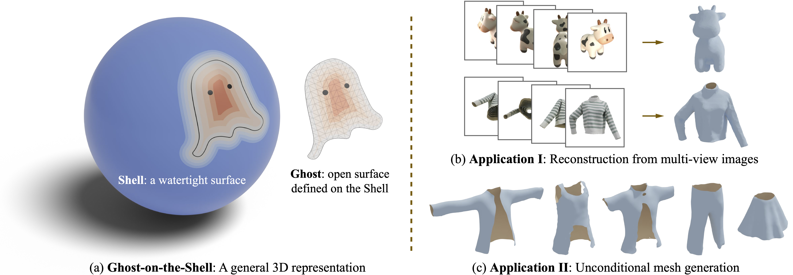

<div align="center">
  
</div>

# Ghost on the Shell: An Expressive Representation of General 3D Shapes


<div align="center">
  
</div>

## Introduction

This is the official implementation of our paper (ICLR 2024 oral) "Ghost on the Shell: An Expressive Representation of General 3D Shapes" (G-Shell).

G-Shell is a generic and differentiable representation for both watertight and non-watertight meshes. It enables 1) efficient and robust rasterization-based multiview reconstruction and 2) template-free generation of non-watertight meshes.

Please refer to [our project page](https://gshell3d.github.io) and [our paper](https://gshell3d.github.io/static/paper/gshell.pdf) for more details.


## Getting Started

### Requirements


- Python >= 3.8
- CUDA 11.8
- PyTorch == 1.13.1

(Conda installation recommended)

#### Reconstruction

Run the following

```
pip install ninja imageio PyOpenGL glfw xatlas gdown
pip install git+https://github.com/NVlabs/nvdiffrast/
pip install --global-option="--no-networks" git+https://github.com/NVlabs/tiny-cuda-nn#subdirectory=bindings/torch
```

Follow the instructions [here](https://github.com/NVIDIAGameWorks/kaolin/) to install kaolin.

Download the tet-grid files ([res128](https://drive.google.com/file/d/1u5FzpuY_BOAg8-g9lRwvah7mbCBOfNVg/view?usp=sharing), [res256](https://drive.google.com/file/d/1JnFoPEGcTLFJ7OHSWrI72h1H9_yOxUP6/view?usp=sharing)) & [res64 for G-MeshDiffusion](https://drive.google.com/file/d/1YQuU4D-0q8kwrzEfla3hGzBg4erBhand/view?usp=drive_link) to `data/tets` folder under the root directory. Alternatively, you may follow https://github.com/crawforddoran/quartet and `data/tets/generate_tets.py` to create the tet-grid files.

#### Generation

Install the following

- Pytorch3D
- ml_collections

## To-dos

- [x] Code for reconstruction
- [ ] DeepFashion3D multiview image dataset for metallic surfaces
- [x] Code for generative models
- [ ] Code for DeepFashion3D dataset preparation
- [ ] Evaluation code for generative models

## Reconstruction

### Datasets

#### DeepFashion3D mesh dataset

We provide ground-truth images (rendered under realistic environment light with Blender) for 9 instances in [DeepFashion3D-v2 dataset](https://github.com/GAP-LAB-CUHK-SZ/deepFashion3D). The download links for the raw meshes can be found in their repo.

non-metallic material: [training data](https://drive.google.com/file/d/1LwBqLYzamFLyBIiNpD6kEkvySrq2nruG/view?usp=sharing), [test data](https://drive.google.com/file/d/1-47dH_yJrUzKVdKbJenslpdyHwDI6QVo/view?usp=sharing)


#### NeRF synthetic dataset

Download the [NeRF synthetic dataset archive](https://drive.google.com/uc?export=download&id=18JxhpWD-4ZmuFKLzKlAw-w5PpzZxXOcG) and unzip it into the `data/` folder.

#### Hat dataset

Download link: https://drive.google.com/file/d/18UmT1NM5wJQ-ZM-rtUXJHXkDc-ba-xVk/view?usp=sharing

RGB images, segmentation masks and the corresponding camera poses are included. Alternatively, you may choose to 1) generate the camera poses with COLMAP and 2) create binary segmentation masks by yourself.

### Training

#### DeepFashion3D-v2 instances

The mesh instances' IDs are [30, 92, 117, 133, 164, 320, 448, 522, 591]. To reconstruct the `$INDEX`-th mesh (0-8) in the list using tet-based G-Shell, run

```
  python train_gshelltet_deepfashion.py --config config/deepfashion_mc_256.json --index $INDEX --trainset_path $TRAINSET_PATH --testset_path $TESTSET_PATH --o $OUTPUT_PATH
```

For FlexiCubes + G-Shell, run

```
  python train_gflexicubes_deepfashion.py --config config/deepfashion_mc_80.json --index $INDEX --trainset_path $TRAINSET_PATH --testset_path $TESTSET_PATH --o $OUTPUT_PATH
```

#### Synthetic data

```
  python train_gshelltet_synthetic.py --config config/nerf_chair.json --o $OUTPUT_PATH
```

#### Hat data

```
  python train_gshelltet_polycam.py --config config/polycam_mc_128.json --trainset_path $TRAINSET_PATH --o $OUTPUT_PATH
```

```
  python train_gshelltet_polycam.py --config config/polycam_mc_128.json --trainset_path $TRAINSET_PATH --o $OUTPUT_PATH
```

#### On config files

You may consider modify the following, depending on your demand:

- `gshell_grid`: the G-Shell grid size. For tet-based G-Shell, please make sure the corresponding tet-grid file exists under `data/tets` (e.g., `256_tets.npz`). Otherwise, follow https://github.com/crawforddoran/quartet and `data/tets/generate_tets.py` to generate the desired tet-grid file.
- `n_samples`: the number of MC samples for light rays per rasterized pixel. The higher the better (at a cost of memory and speed).
- `batch_size`: how many views sampled in each iteration.
- `iteration`: total number of iterations.
- `kd_min`, `kd_max`, etc: the min/max of the corresponding PBR material parameter.


## Generation

### Preparation

Download info files for the underlying tet grids and binary masks that indicating which locations store useful values in the cubic grids from [tet_info.pt](https://drive.google.com/file/d/19Dw_hOpcVHazpm2_1qA7T7j5xABOUWxv/view?usp=drive_link), [global_mask_res64.pt](https://drive.google.com/file/d/1mlSnu23_u08HH5aO3x5z1V9GzguFzoiT/view?usp=drive_link), [cat_mask_res64.pt](https://drive.google.com/file/d/11Bm4CQX-y1X7R47AfQQz20s7oP6AbbNK/view?usp=drive_link) and [occ_mask_res64.pt](https://drive.google.com/file/d/1qEqqLfZe633GdVkj5MGOCON_kf0l4e4G/view?usp=drive_link). Put these files under `GMeshDiffusion/metadata/`.

#### For evaluation

Download the pretrained model for [upper-body garments]() and [lower-body garments]().

#### For training

1) Download the processed Cloth3D garment dataset (for upper-body & lower-body garments) from [link](). Alternatively, you may create a grid dataset for your own objects by a) normalize your datapoints by re-center and re-scaling meshes, b) fitting G-Shell representations and c) turn these representations into cubid grids by running `GMeshDiffusion/metadata/tet_to_cubic_grid_dataset.py`.

2) Run `GMeshDiffusion/metadata/get_splits_lower.py` and/or `GMeshDiffusion/metadata/get_splits_upper.py` to generate lists of training and test datapoints.


### Evaluation

1. Modify the batch size in config files in `GMeshDiffusion/diffusion_config/` and enter the desired directories and values (for model checkpoints, where to store generated samples, etc.) in `GMeshDiffusion/scripts`.
2. Run the eval scripts in `GMeshDiffusion/scripts`.
3. Run `eval_gmeshdiffusion_generated_samples.py` to extract triangular meshes.

### Training

1. Enter the desired directories (for model checkpoints and where to store generated samples) in `GMeshDiffusion/scripts`.
2. Modify the config files if necessary.
3. Run the training scripts in `GMeshDiffusion/scripts`.


## Citation

If you find our work useful to your research, please consider citing:

```
@article{liu2024gshell,
    title={Ghost on the Shell: An Expressive Representation of General 3D Shapes},
    author={Liu, Zhen and Feng, Yao and Xiu, Yuliang and Liu, Weiyang and Paull, Liam and Black, Michael J. and Sch{\"o}lkopf, Bernhard},
    booktitle={The Twelfth International Conference on Learning Representations},
    year={2024},
}
```


## Acknowledgement

We sincerely thank the authors of [Nvdiffrecmc](https://github.com/NVlabs/nvdiffrecmc), [FlexiCubes](https://github.com/nv-tlabs/FlexiCubes) and https://github.com/yang-song/score_sde_pytorch for sharing their codes. Our repo is adapted from [MeshDiffusion](https://github.com/lzzcd001/MeshDiffusion/).
